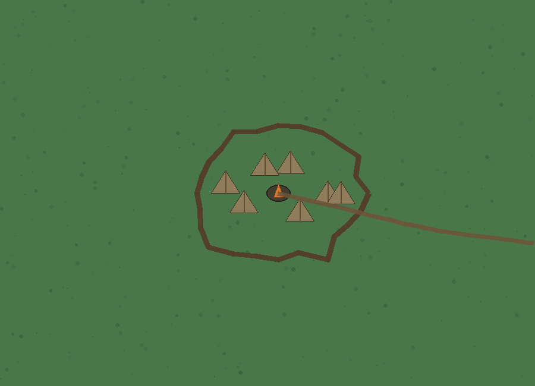
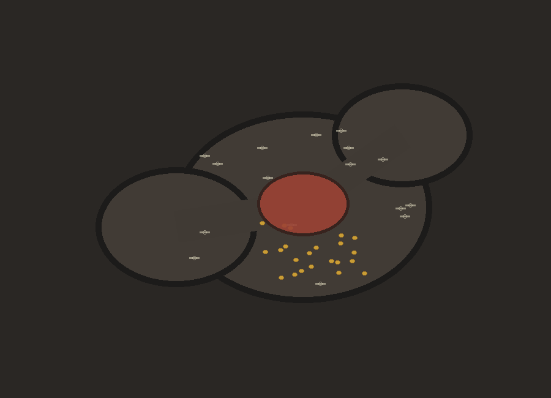
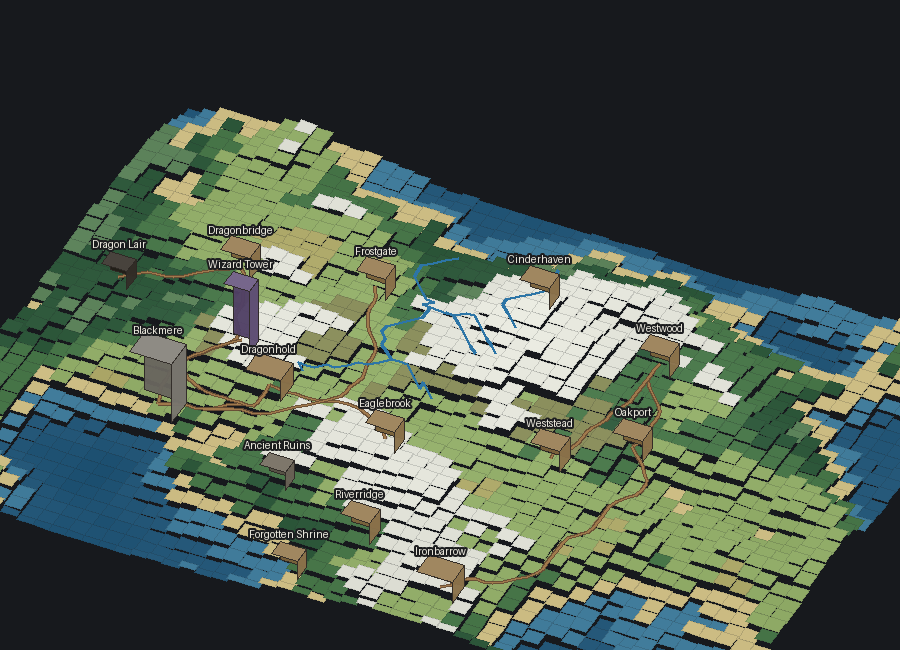

# CampaignForge 1.1.0

CampaignForge is a portable Python desktop world builder and tabletop map editor. It keeps one persistent campaign world and reveals more detail as you move from the world map into regions, settlements, buildings, floors, rooms, and objects.

The core hierarchy is:

**World → Region/Biome → Settlement/Special Location → Building → Floor → Room → Furniture/Object**

The important rule in 1.1.0 is continuity: zooming should reveal the same place at a finer level of detail rather than generating an unrelated replacement.

## 1.1.0 highlights

### Persistent zoom geometry and roads

- Parent road entrances are inherited by detailed settlement views.
- A town with two major incoming roads receives two major incoming roads in its detailed scene.
- Local streets may exist inside the settlement without inventing extra external connections.
- Buildings retain source dimensions, orientation metadata, and road-facing entrance direction.
- Multi-floor buildings retain floor count and source geometry.
- Previously generated scenes remain linked and are reused instead of regenerated.
- Extreme area selections are normalized to a usable aspect ratio without stretching the parent terrain image.

### Geography-aware world roads

The world road graph is optional rather than universally connected.

- villages have fewer possible connections than major settlements
- distant settlement pairs are normally rejected
- castles receive a modest access preference
- terrain-aware A* routing avoids open water and heavily penalizes steep/mountainous terrain
- isolated settlements are allowed
- road minimum, maximum, and connection probability remain configurable

### Distinct special locations

Dedicated generators now exist for:

- castles
- compact forts
- mage towers
- bandit camps
- caves and terminal deep caverns
- dragon lairs
- ruined settlements
- ocean locations

Bandit camps use tents, rough huts, palisades, supplies, loot, and bandits rather than the city-house generator. Dragon lairs use cavern/ruin environments and include a large multi-cell dragon. Deep caves are terminal locations, preventing cave → cave → cave recursion.





### Better settlements and wilderness

Cities and towns can contain a wider mix of buildings, including taverns, blacksmiths, shops, apothecaries, bakeries, stables, guild halls, warehouses, mage shops, temples, libraries, and noble houses.

Wilderness generation was reduced so ordinary plains and forests remain mostly wilderness. Houses and points of interest are discoveries rather than automatic filler.

### Better interiors

Interiors now use a persistent building footprint with exterior biome outside the walls.

- variable connected room layouts
- source building aspect ratio is preserved
- doors face the inherited parent entrance when possible
- different building profiles use different rooms, flooring, and furniture pools
- furniture is represented as persistent movable objects
- tables, chairs, beds, wardrobes, chests, shelves, lamps, desks, cabinets, rugs, fireplaces, barrels, crates, plants, workbenches, weapon racks, anvils, forges, pews, altars, counters, stalls, statues, and chess boards are supported
- object rotation is visible and objects can be moved with the same transform workflow as characters/custom PNGs

Large buildings can generate a floor-section scene. Selecting a floor enters that floor while preserving the parent building identity and floor count.

### Climate and terrain

World terrain continues to use interacting:

- Temperature
- Maximum Altitude
- Moisture

Rivers are terrain/moisture driven when automatic generation is enabled. River paths generally start high and descend toward lower terrain. Mountains are communicated by terrain shading/elevation rather than redundant mountain glyph spam.

### Grid and input

- Square and hex overlays remain available from the toolbar.
- Enabling a grid immediately snaps all movable objects when snapping is enabled.
- Larger entities keep their size and record their multi-cell footprint while their center snaps to the nearest valid cell.
- Mouse Button 4 and Button 5 can zoom while the pointer/focus is on the map.

### Assets and transforms

Imported PNGs remain editable and persistent.

- rename assets
- reversible pixelation from the original PNG
- resize/scale
- rotate
- horizontal/vertical flip
- move/reposition
- preserve transparency
- texture replacement slots

Assigned replacement textures are read dynamically by the editor, so supported existing semantic objects/furniture update without leaving placeholder squares.

### Experimental 2.5D view

The **View** tab contains an initial Experimental 2.5D renderer.

It is not a second world generator. It renders the same current `Scene` data with:

- terrain elevation
- tilt
- horizontal rotation
- elevation exaggeration
- roads/rivers
- extruded buildings and landmarks
- taller towers and multi-floor buildings
- larger physical scale for dragons/large creatures

The renderer uses a bounded terrain mesh so it remains practical on large maps. Normal 2D remains the editing-first view.



### Persistent saves

`.cforge` projects save the campaign rather than only an image:

- generated scene hierarchy
- current scene
- parent/child links
- roads and paths
- buildings/floors/rooms
- NPCs, furniture, and custom PNG objects
- asset library and texture assignments
- generation settings
- grid state
- zoom and viewport position
- 2D/2.5D view and experimental camera state

Portable builds use a local `CampaignForge Saves` directory beside the EXE when writable and fall back to the user's local application-data directory otherwise. Autosave and named local saves are both supported.

## Run from source

Requirements:

- Python 3.10+
- Pillow
- Tkinter

```bash
python -m pip install -r requirements.txt
python campaign_forge.py
```

On Windows, `run.bat` is also included.

## Build the portable Windows EXE

Run on Windows:

```text
build_windows.bat
```

The one-file executable is created at:

```text
dist\CampaignForge.exe
```

The GitHub Actions workflow also runs the automated tests and builds `CampaignForge-v1.1.0-Windows-Portable.zip` on a Windows runner.

## Tests

```bash
python tests/smoke_generation.py
python tests/lod_and_editor_features.py
python tests/version2_features.py
python tests/update_110_features.py
```

The 1.1.0 tests cover exact inherited road counts, special-location identity, terminal cave depth, multi-floor persistence, movable furniture, parent-facing entrances, and same-scene Experimental 2.5D rendering.

## Project layout

```text
campaign_forge.py
campaignforge/
  app.py
  assets.py
  biomes.py
  context.py
  experimental.py
  generators.py
  grid.py
  local_saves.py
  model.py
  persistence.py
  world_engine.py
tests/
.github/workflows/build-windows.yml
CampaignForge.spec
build_windows.bat
```

## License

MIT.
