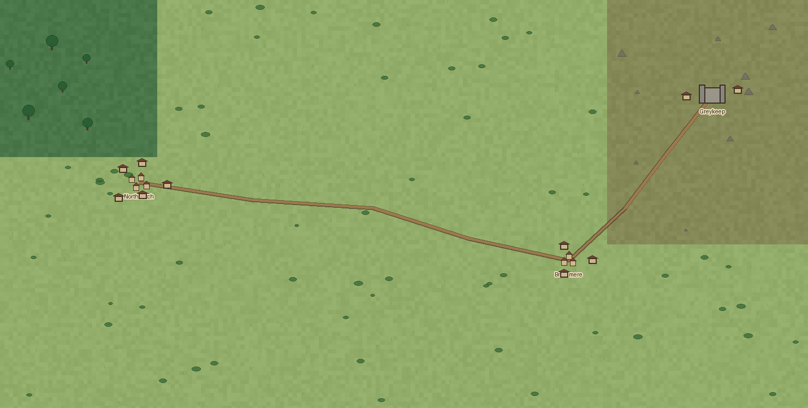
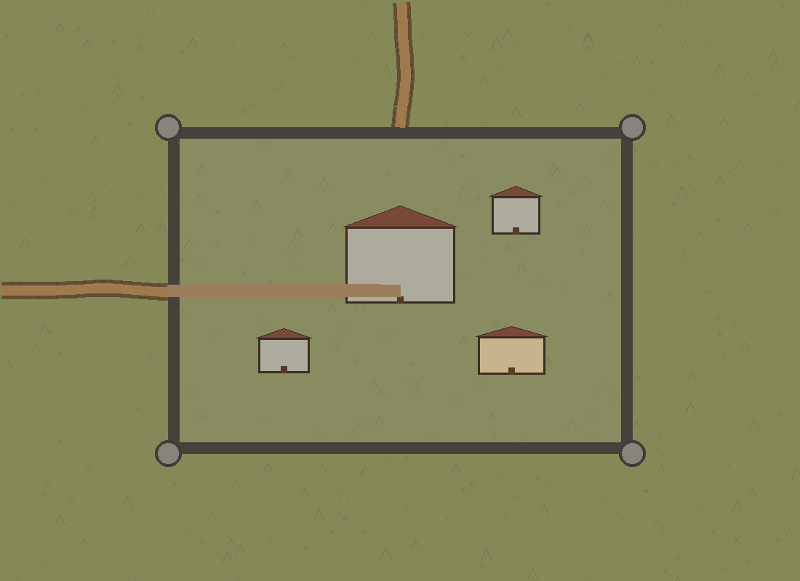
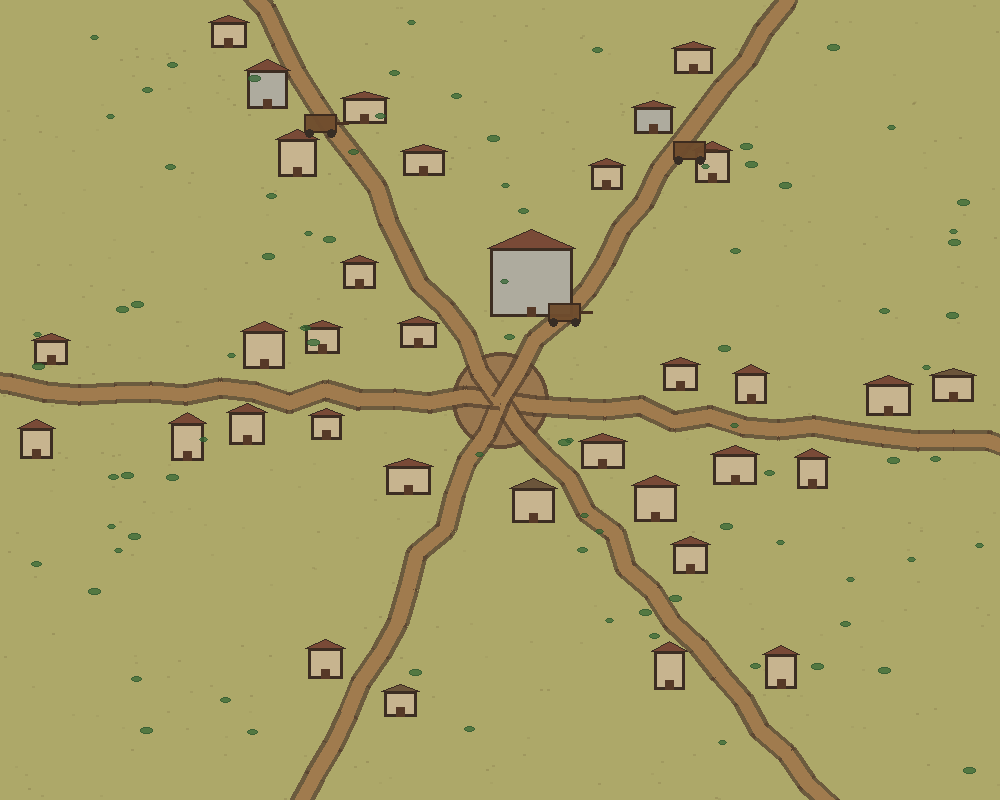
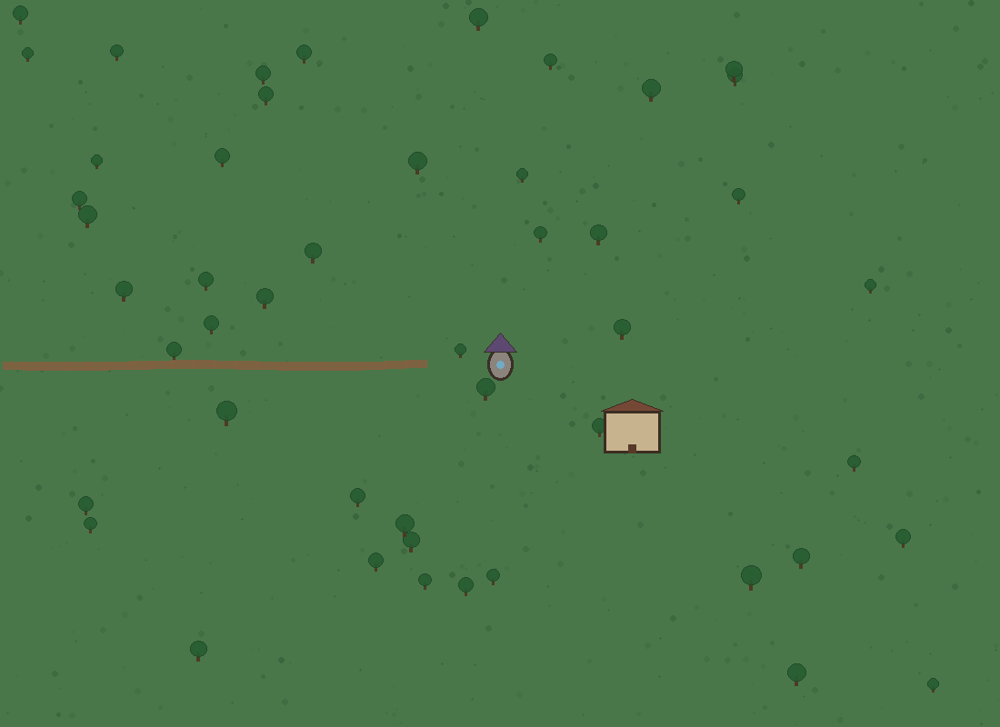
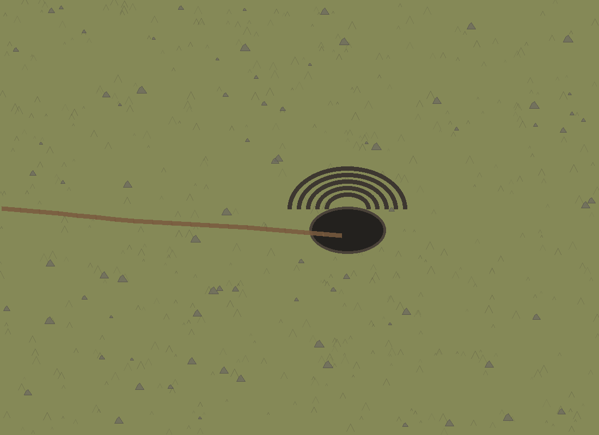
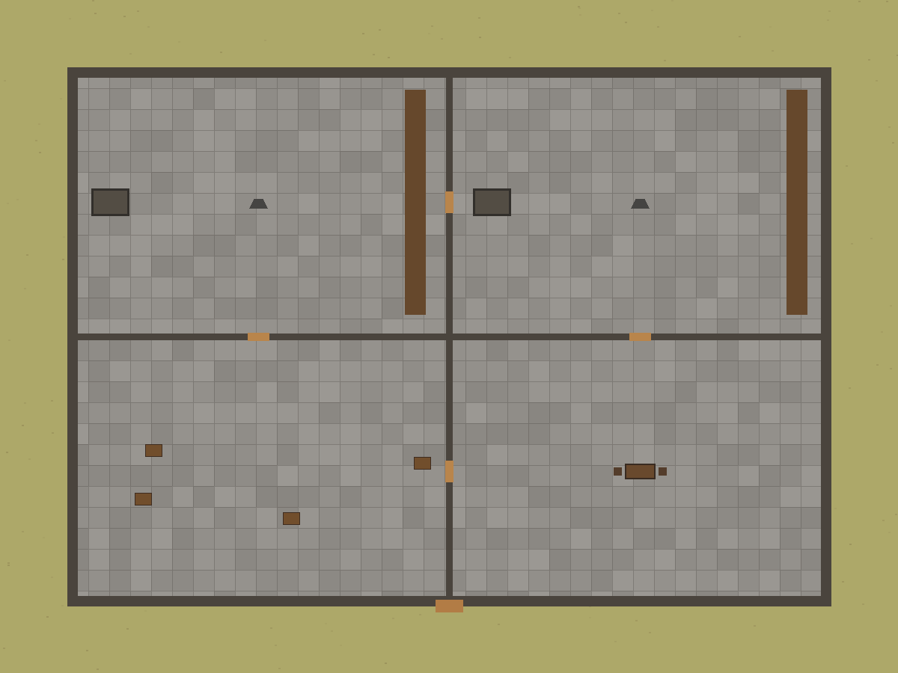
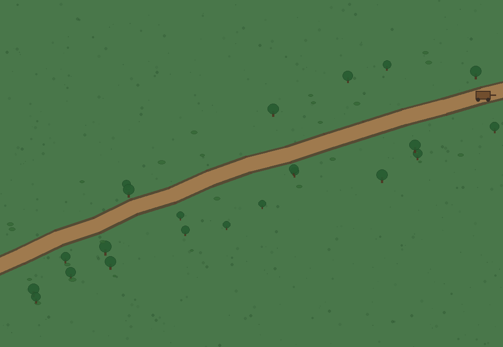
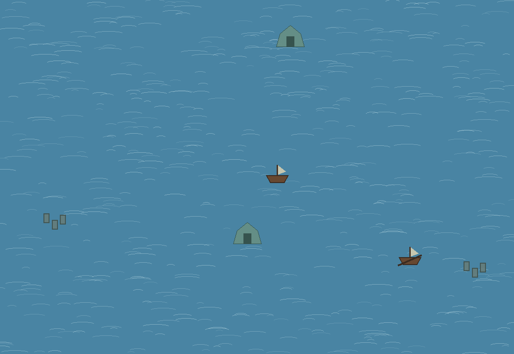

# CampaignForge 1.0

CampaignForge is a context-aware procedural world builder and map editor for tabletop campaigns. It is designed around one persistent world rather than a collection of unrelated random maps.

The navigation model is:

**World → Region / Terrain → Town / Castle / Cave / Mage Tower → Building → Room**

Generation at every level inherits location identity, biome, major roads, relative position, and existing generated content from its parent.


### Multi-location selections

Selecting an area that contains several cities or major locations now creates an area-level map containing **all of them**. It no longer picks one settlement and turns the entire selection into that settlement's detailed view.

The child map preserves:

- every selected city/locations
- each location's type
- relative position and distance
- inherited roads and trails
- biome layout
- links to already-generated child scenes

A town, village, castle, cave, and mage tower can therefore coexist in one regional detail map at the appropriate simplified LOD.



### Stable roads between zoom levels

Major road identity is carried through the hierarchy. Roads store endpoint/location references, are clipped into selected detail areas, and are transformed into child coordinates instead of being invented again.

When entering a town or castle, the detailed generator reads the directions of the roads that actually connect to that location. Those roads become the entrances to the detailed map. A town with two inherited regional roads therefore receives two major entrances instead of six random spokes from its center.

### Proper major location types

CampaignForge now treats these as first-class explorable locations:

- towns and villages
- castles and forts
- caves, mines, and dungeon entrances
- mage/wizard towers

Castles have gates and inherited road approaches, mage towers use appropriate grounds and paths, and caves use trails and rocky/underground context.



### Generated sub-area deletion

The Campaign tab contains **Delete Selected Sub-Area**. It deletes only the selected generated scene and its generated descendants. The parent world/region and unrelated branches are kept, and any links to the deleted branch are safely cleared.

### Asset editing and transforms

Imported PNGs can now be:

- renamed
- intentionally pixelated from the original source
- restored to the original unpixelated image
- moved
- scaled larger/smaller
- resized to exact dimensions
- freely stretched when aspect locking is disabled
- rotated in 15-degree increments
- flipped horizontally or vertically
- reset to the original placed transform

The same Transform panel is used for movable NPCs and placed PNG objects instead of putting resize controls inside the NPC tool.

### Rendering and performance

The editor now uses several lightweight rendering optimizations:

- cached grid/base images
- cached scaled map previews
- fast bilinear rendering while actively zooming/dragging
- deferred high-quality Lanczos rendering after interaction stops
- throttled object-drag redraws
- canvas-native panning without map regeneration
- reduced dynamic NPC detail at distant zoom levels
- vector redraws for semantic location icons at high zoom to keep them sharper
- generated scene reuse instead of regenerating existing child locations

## Core context-aware generation

A selected area is analyzed before anything is generated. The app considers:

- current hierarchy level
- dominant biome
- every major location inside the selection
- selection scale
- inherited roads/trails/rivers
- buildings and rooms at the current hierarchy level
- existing generated children

That context determines the allowed generator and LOD.

## Features

### Persistent world exploration

- Persistent linked scene hierarchy
- Double-click towns, castles, caves, and mage towers to generate/enter them
- Double-click buildings to generate interiors
- Double-click rooms for room-scale detail
- Double-click previously generated map areas to revisit them
- Scroll-wheel zoom
- Animated transitions between existing scenes
- Parent/child links remain persistent in saved campaigns

### Logical terrain detail

- Town buildings cluster along local streets
- Regional roads retain their geometry in child maps
- Road scenes add roadside vegetation, signs, carts, and travelers
- Ocean scenes use boats, shipwrecks, islands, sea ruins, and ocean monuments
- Forest scenes use forest-compatible structures and vegetation
- Dry/desert terrain uses compatible ruins, camps, and sparse vegetation
- Hills/mountains use caves, mines, forts, ruins, and rocky details
- Biome restrictions prevent land structures from appearing in open ocean

### Building interiors

Interiors are generated as coherent building footprints. Areas outside the walls remain exterior terrain rather than unexplained floor space.

Profiles include:

- Houses
- Taverns
- Blacksmiths
- Shops
- Libraries
- Temples
- Wizard buildings
- Castles
- Farmhouses

Profiles use different room purposes, floor materials, wall styles, and furniture.

### NPCs and custom assets

- Built-in draggable NPC palette
- Persistent movable NPCs
- Transparent PNG import
- Place imported PNGs anywhere on a scene
- Reusable asset library
- Texture replacement slots for buildings, terrain objects, furniture, carts, boats, and NPCs

### Generation rules

The Rules tab can toggle categories including:

- Towns
- Houses
- Roads
- Ruins / caves
- Dungeons
- Castles
- NPCs
- Boats
- Carts
- Furniture
- Wildlife
- Biome decoration
- Ocean structures
- Underground structures

Biome compatibility is still enforced when a category is enabled.

### Project persistence

Save the campaign as a `.cforge` project. Projects store:

- generated scenes
- scene hierarchy
- source rectangles
- entities and moved positions
- roads and location identities
- imported PNG assets
- asset names and pixelation settings
- object transform metadata
- assigned texture replacements
- generation settings

### Aspect-ratio-safe detail maps

Selections are never forced into a fixed shape. Detail dimensions are calculated from the source rectangle, and terrain is rebuilt from parent biome data instead of stretching a screenshot.

### Grid overlays

- Square grid
- Hex grid
- Adjustable cell size

## Screenshots

### Multi-location regional LOD


### Town detail



### Castle detail


### Mage tower detail



### Cave detail



### Building interior



### Road encounter



### Ocean detail



## Running from source

Requirements:

- Python 3.10+
- Pillow
- Tkinter

Install:

```bash
python -m pip install -r requirements.txt
```

Run:

```bash
python campaign_forge.py
```

On Windows you can also double-click `run.bat`.

## Building the portable Windows EXE

On Windows, double-click:

```text
build_windows.bat
```

The result is:

```text
dist\CampaignForge.exe
```

It is a one-file portable executable and does not require an installer.

## GitHub Actions Windows build

The included workflow builds the portable EXE on GitHub's Windows runner.

1. Push the repository to GitHub.
2. Open **Actions**.
3. Run **Build Windows Portable**.
4. Download the `CampaignForge-Windows-Portable` artifact.

A `v1.0.0` tag can also create a GitHub Release containing the portable ZIP.

## Tests

Run:

```bash
python tests/smoke_generation.py
python tests/lod_and_editor_features.py
```

The LOD/editor tests cover multi-city selection, relative-position preservation, road entrance continuity, castle/cave/mage-tower generation, safe sub-area deletion, and reversible imported-image editing.

## Project structure

```text
campaign_forge.py
campaignforge/
  app.py
  assets.py
  biomes.py
  context.py
  generators.py
  model.py
  persistence.py
  world_engine.py
assets/
screenshots/
tests/
ARCHITECTURE.md
CampaignForge.spec
build_windows.bat
```

See [ARCHITECTURE.md](ARCHITECTURE.md) for the hierarchy, identity, LOD, road-continuity, and rendering design.

## License

MIT
